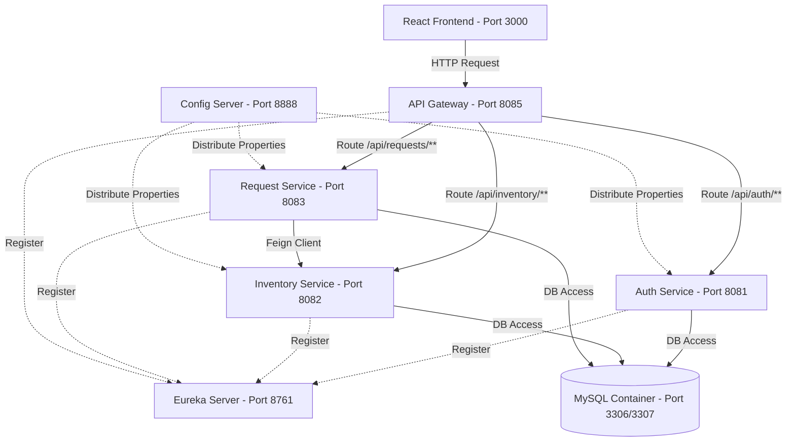

# System Architecture

The College University Stationery Management System uses a modular Spring Boot microservices architecture to manage authorization, inventory item tracking, and stationery requisitions.

## Services Layout

