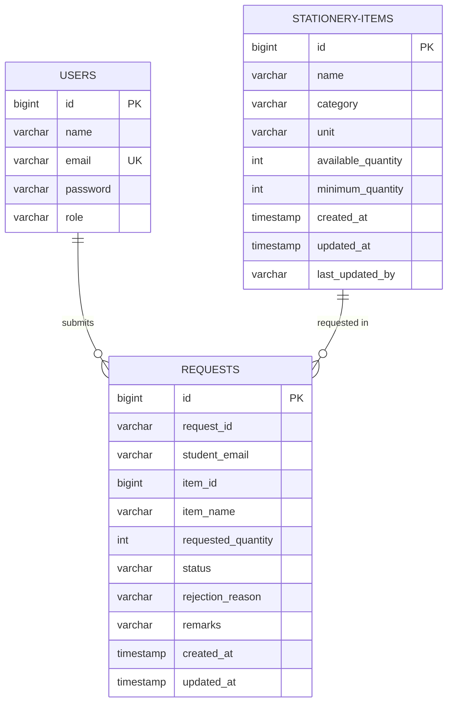

---

Open [database-schema.md](file:///C:/Users/ARYA%20VAJPAI/OneDrive/Desktop/stationery-management/stationery-management/docs/database-schema.md), replace all its contents with this schema guide:

````markdown
# Database Schema Design

The system implements the database-per-service pattern, with three isolated MySQL databases hosted within the `stationery-mysql` container.


````
